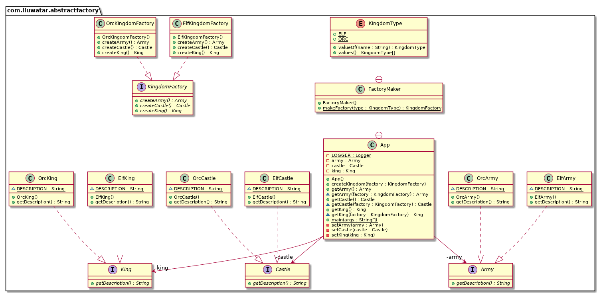

## Alternativbezeichnung

* Kit

## Zweck

Das Abstract-Factory-Pattern stellt ein Interface zum Erzeugen von Instanzen einer Familie
ähnlicher oder voneinander abhängiger Objekte zur Verfügung, ohne dass dabei deren konkrete Klasse
festgelegt ist. Damit werden Modularität und Flexibilität im Softwaredesign verbessert.

## Detaillierte Erklärung
Reales Beispiel

> Stellen Sie sich einen Möbelhersteller vor, der Möbelstücke in verschiedenen Stilen anbietet, z.B. modern, viktorianisch, rustikal. Zu jedem Stil gibt es Produkte wie Stühle, Tische und Sessel. Um Produkte unabhängig vom Stil einheitlich verwalten zu können, wird das Abstract-Factory-Pattern eingesetzt.
>
> Dabei ist die Abstract Factory ein Interface, mit dem mehrere Familien zusammengehöriger Möbelstücke (Stühle, Tische, Sessel) erzeugt werden. Jede einzelne konkrete Factory (ModernFurnitureFactory, VictorianFurnitureFactory, RusticFurnitureFactory) implementiert dieses Interface und erzeugt Möbelstücke des jeweiligen Stils. Auf diese Weise können ganze Einrichtungen in einem bestimmten Stil produziert werden, ohne dass man sich um die Details der Instantiierung kümmern muss. Das erlaubt eine einheitliche Bearbeitung und einen einfachen Wechsel des Einrichtungsstils.

In einfachen Worten

> Eine Factory für Factories - eine Factory, die mehrere zusammengehörende Factories vereinigt, ohne die konkrete Klasse der Objekte festzulegen.

Wikipedia sagt

> Das Abstract-Factory-Pattern dient zur Kapselung einer Gruppe einzelner Factories mit gemeinsamem Thema, wobei deren konkrete Klasse variabel bleibt.

Klassendiagramm



## Programmbeispiel

Um ein Königreich mit dem Abstract-Factory-Pattern zu erzeugen, brauchen wir ein gemeinsames Thema. Das Elben-Königreich hat einen Elbenkönig, ein Elbenschlos und eine Elbenarmee, das Ork-Königreich dagegen einen Orkkönig, ein Orkschloss und eine Orkarmee. Die Objekte des jeweiligen Königreichs hängen voneinander ab.

Zunächst definieren wir die Interfaces und implementieren sie für die einzelnen Königreiche.

```java
public interface Castle {
    String getDescription();
}

public interface King {
    String getDescription();
}

public interface Army {
    String getDescription();
}

// Elben-Implementationen ->
public class ElfCastle implements Castle {
    static final String DESCRIPTION = "This is the elven castle!";

    @Override
    public String getDescription() {
        return DESCRIPTION;
    }
}

public class ElfKing implements King {
    static final String DESCRIPTION = "This is the elven king!";

    @Override
    public String getDescription() {
        return DESCRIPTION;
    }
}

public class ElfArmy implements Army {
    static final String DESCRIPTION = "This is the elven Army!";

    @Override
    public String getDescription() {
        return DESCRIPTION;
    }
}

// Ork-Implementations analog -> ...
```

Nun kommt das Interface für die Königreich-Factory und seine Implementationen.

```java
public interface KingdomFactory {
    Castle createCastle();

    King createKing();

    Army createArmy();
}

public class ElfKingdomFactory implements KingdomFactory {

    @Override
    public Castle createCastle() {
        return new ElfCastle();
    }

    @Override
    public King createKing() {
        return new ElfKing();
    }

    @Override
    public Army createArmy() {
        return new ElfArmy();
    }
}

// Ork-Implementationen analog -> ...
```

Jetzt können wir eine Factory bauen, die eine Instanz von entweder `ElfKingdomFactory` oder `OrcKingdomFactory` erstellt. Diese nennen wir `FactoryMaker`. Der Client kann `FactoryMaker` verwenden, um die gewünschte Factory zu erzeugen, mit der dann wiederum konkrete Objekte (abgeleitet von `Army`, `King`, `Castle`) erzeugt werden können. In diesem Beispiel nutzen wir ein Enum als Parameter für die gewünschte Art der Factory.

```java
public static class FactoryMaker {

    public enum KingdomType {
        ELF, ORC
    }

    public static KingdomFactory makeFactory(KingdomType type) {
        return switch (type) {
            case ELF -> new ElfKingdomFactory();
            case ORC -> new OrcKingdomFactory();
        };
    }
}
```

Hier die main-Methode der Beispielanwendung:

```java
LOGGER.info("elf kingdom");
createKingdom(Kingdom.FactoryMaker.KingdomType.ELF);
LOGGER.info(kingdom.getArmy().getDescription());
LOGGER.info(kingdom.getCastle().getDescription());
LOGGER.info(kingdom.getKing().getDescription());

LOGGER.info("orc kingdom");
createKingdom(Kingdom.FactoryMaker.KingdomType.ORC);
LOGGER.info(kingdom.getArmy().getDescription());
LOGGER.info(kingdom.getCastle().getDescription());
LOGGER.info(kingdom.getKing().getDescription());
```

Ausgabe:

```
07:35:46.340 [main] INFO com.iluwatar.abstractfactory.App -- elf kingdom
07:35:46.343 [main] INFO com.iluwatar.abstractfactory.App -- This is the elven army!
07:35:46.343 [main] INFO com.iluwatar.abstractfactory.App -- This is the elven castle!
07:35:46.343 [main] INFO com.iluwatar.abstractfactory.App -- This is the elven king!
07:35:46.343 [main] INFO com.iluwatar.abstractfactory.App -- orc kingdom
07:35:46.343 [main] INFO com.iluwatar.abstractfactory.App -- This is the orc army!
07:35:46.343 [main] INFO com.iluwatar.abstractfactory.App -- This is the orc castle!
07:35:46.343 [main] INFO com.iluwatar.abstractfactory.App -- This is the orc king!
```

## Verwendung

Einsatzkriterien für Abstract Factory:
* Das System sollte nicht davon abhängig sein, wie die Produkte erzeugt, zusammengesetzt und dargestellt werden.
* Nötige Konfiguration für eine oder mehrere Produktfamilien.
* Eine Familie ähnlicher Produkte muss gemeinsam auf gleiche Art genutzt werden.
* Die Klassenbibliothek der Produkte zeigt dem Anwender nur ihre Interfaces, nicht ihre Implementation.
* Abhängigkeiten zwischen den Produkten existieren kürzer als die Verwendung dauert.
* Abhängigkeiten müssen zur Laufzeit durch Parameter konstruiert werden.
* Zur Laufzeit wird ein Produkt aus einer Familie ausgewählt.
* Keine Code-Änderungen bei Hinzufügen weiterer Familien oder Produkte.

## Tutorials

* [Abstract Factory Design Pattern in Java (DigitalOcean)](https://www.digitalocean.com/community/tutorials/abstract-factory-design-pattern-in-java)
* [Abstract Factory(Refactoring Guru)](https://refactoring.guru/design-patterns/abstract-factory)

## Vor- und Nachteile

Vorteile:

* Flexibilität: Einfacher Wechsel zwischen Produktfamilien ohne Codeänderung.

* Entkopplung: Der Verwender sieht nur abstrakte Interfaces, wodurch sich Portabilität und Wartbarkeit verbessern. 

* Wiederverwendbarkeit: Objekte aus einer Abstract Factory können projektübergreifend eingesetzt werden.

* Wartbarkeit: Änderungen an einer einzelnen Produktfamilie sind nur lokal in deren Implementation nötig, was Updates erleichtert.
* 
Nachteile:

* Komplexität: Anfänglicher Zusatzaufwand für die Definition von Interfaces und konkreten Factories.
* 
* Intransparenz: Die Transparenz könnte leiden, weil der Client-Code mit den Produkten nur indirekt über den Umweg der Factories interagiert.

## Reale Anwendungen 

* Die `LookAndFeel` Klassen von Java Swing stellen mittels Abstract Factory verschiedene optische Darstellungen zur Verfügung.
* Verschiedene Implementationen im Java Abstract Window Toolkit (AWT) zur Erzeugung diverser GUI-Komponenten.
* [javax.xml.parsers.DocumentBuilderFactory](http://docs.oracle.com/javase/8/docs/api/javax/xml/parsers/DocumentBuilderFactory.html)
* [javax.xml.transform.TransformerFactory](http://docs.oracle.com/javase/8/docs/api/javax/xml/transform/TransformerFactory.html#newInstance--)
* [javax.xml.xpath.XPathFactory](http://docs.oracle.com/javase/8/docs/api/javax/xml/xpath/XPathFactory.html#newInstance--)

## Verwandte Patterns

* [Factory-Methoden](https://java-design-patterns.com/patterns/factory-method/): Abstract Factory verwendet Factory-Methoden zur Erzeugung von Produkten.
* [Singleton](https://java-design-patterns.com/patterns/singleton/): Abstract-Factory-Klassen sind häufig als Singletons implementiert.
* [Factory Kit](https://java-design-patterns.com/patterns/factory-kit/): Ähnlich wie Abstract Factory, aber mit Schwerpunkt auf flexibler Konfiguration und Verwaltung verwandter Objekte .

## Quellen

* [Design Patterns: Elements of Reusable Object-Oriented Software](https://amzn.to/3w0pvKI)
* [Design Patterns in Java](https://amzn.to/3Syw0vC)
* [Head First Design Patterns: Building Extensible and Maintainable Object-Oriented Software](https://amzn.to/49NGldq)
* [Java Design Patterns: A Hands-On Experience with Real-World Examples](https://amzn.to/3HWNf4U)
